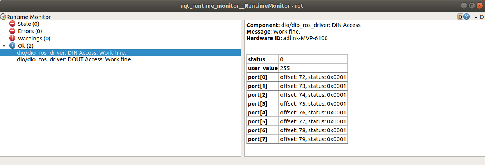
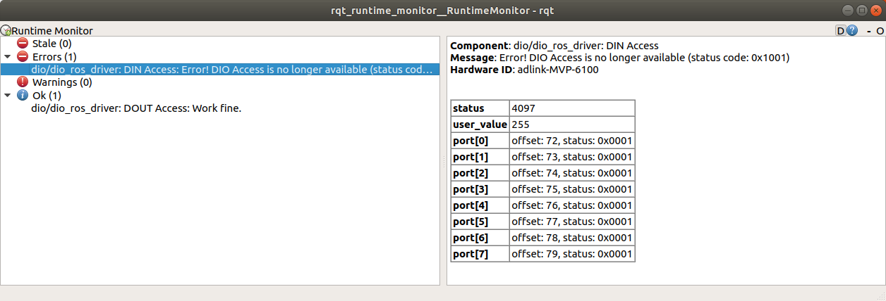

# dio_ros_driver
ROS Driver for accessing DIO with libgpiod

----------------------------------

# Overvew
In the golf-cart project, DIO module is used for several purpose.  
This system has `dio_ros_driver` to communicate DI/DO ports via ROS topic.

`dio_ros_driver` sends topics which includes boolean value read from corresponding DI port.
`dio_ros_driver` receives topics which request it to set a certain value to a selected port. `dio_ros_driver` sets the value at the port .

## Execution
```
$ roslaunch dio_ros_driver dio_ros_driver.launch chip_name:="gpiochip0" access_frequency:=10.0
```

After executing this command, `dio_ros_driver_node` will run without any message.
You can observe topics such as `/dio/din[0-7]`, and `/dio/dout[0-7]`. `/dio/din[0-7]` have a boolean value read from a corresponding port. On the other hand, `/dio/dout[0-7]` have a boolean value to be written to a corresponding port.
`dio_ros_driver_node` borrows ROS `diagnostics` framework as diagnostic function, and publishes `/diagnostics` topic.


## Arguments
* `chip_name`: to select `gpiodchip[0-9]` in `/dev` directory
* `access_frequency`: to set access frequency (default: 10.0)
* `din_value_inverse`: to inverse raw value from DIN port. If this value is true, raw value 0 is converted into value 1 when publishing topic (default: false)
* `dout_value_inverse`: to inverse raw value from DOUT port. If this value is true, raw value 0 is converted into value 1 when setting value (default: false)
* `dout_default_value`: initial boolean value for DO ports (default: true)
  * default value is true because initial value from DO port of ADLINK's MVP-6100 has **1 (true)**


**Note:** `dout_value_inverse` option influences on `dout_default_value`.
The following truth table shows the initial value of DO port according to the combination of `dout_value_inverse` and `dout_default_value`.

| `dout_value_inverse` | `dout_default_value` | DO raw value | DO user value |
| ---                  | ---                  | ---          | ---           |
|  0                   | 0                    | 0            | 0             |
|  0                   | 1                    | 1            | 1             |
|  1                   | 0                    | 1            | 0             |
|  1                   | 1                    | 0            | 1             |


## Topics
* `/dio/din[0-7]`
  * message type: `dio_ros_driver/DIOPort`
  * description: Boolean value read from DI ports
* `/dio/dout[0-7]`
  * message type: `dio_ros_driver/DIOPort`
  * descritpion: Boolean value written into DO ports
* `/diagnostics`
  * message type: `diagnostic_msgs/DiagnosticArray`
  * description: Diagnostic notification sent at frequency. The notification is provided per a bundle of DI ports and that of DO ports.

## Termination
If you want to shutdown `dio_ros_node`, you have to send `SIGTERM` signal.


## Config file
In [`port_list.yaml`](./msg/port_list.yaml), port offset is listed as below. 

```
din_ports:
  - 72 # DIN port 0
  - 73 # DIN port 1
  - 74 # DIN port 2
  - 75 # DIN port 3
  - 76 # DIN port 4
  - 77 # DIN port 5
  - 78 # DIN port 6
  - 79 # DIN port 7

dout_ports:
  - 105 # DOUT port 0
  - 106 # DOUT port 1
  - 107 # DOUT port 2
  - 108 # DOUT port 3
  - 109 # DOUT port 4
  - 110 # DOUT port 5
  - 111 # DOUT port 6
  - 112 # DOUT port 7
```

Port offset means the port address shown by `gpioinfo` command. The port offset is associated with the ordering number in the list. For example, this `port_list.yaml` indicates that 0th DI port is corresponded to 72th offset of the DI module.  
The list is defined based on DIO module coupled with ADLINK's MVP-6100 series.

**Warning:** You have to choose at least a single couple of DI port and DO port.  And, You cannot add more than 8 ports to this list.

## Constraints
* This node read data from DI port and write value to DO port periodically. If port value is updated several times in less period than access cycle, the node would use the last value when updating ports.
* You can add from 1 to 8 ports to access. At least, you have to choose a DI port and DO port.

## Status code
Status code is provided to notify the status of `dio_ros_driver`. The status code is included in `/diagnostics` topic, and is consumed by `diagnostic aggregator` and `rqt_runtime_monitor`.  
  `rqt_runtime_monitor` shows the status code and update it per period.

Two types of status code is provided: port-bundle-level and port-level. The port-bundle-level status code shows status of whole DI or DO ports. The port-bundle-level status code is used to notify error if any DIO port has any error. The port-level status code is assigned to each port, and shows each status of port. They are prepared for DI ports and DO ports, respectively. 

The following value table shows port-bundle-level status code.
The port-bundle-level status code is defined as `uint16_t`.


| status code value | severity | definition |
| ---               | ---      | ---  |
| 0x0000            | OK  | DIO is accessed without any error. |
| 0x0100            | WARNING  | There is no initialized port. |
| 0x0101            | WARNING  | Unexpectedly, value is written to input port. |
| 0x1000            | ERROR    | Selected GPIO chip is not opened because of existence, permission, or a certain reason. |
| 0x1001            | ERROR    | More than 8 ports are selected to access |
| 0x1002            | ERROR    | Unassigned port is accessed. (This error would not be reached in this implementation) |
| 0x1003            | ERROR    | `dio_ros_driver` cannot get all values from assigned ports. |
| 0x1004            | ERROR    | `dio_ros_driver` cannot reset all of assigned DO ports. |
| 0x1005            | ERROR    | `dio_ros_driver` cannot get access permission to a certain DI or DO port. |
| 0x1006            | ERROR    | `dio_ros_driver` cannot give direction to a certain port. |
| 0x1007            | ERROR    | `dio_ros_driver` failed in getting value from a port. |
| 0x1008            | ERROR    | `dio_ros_driver` failed in setting value to a port. |


**Warning:** Once any error occurs on any of DI ports, `dio_ros_driver` would not publishing `/dio/din[0-7]` topics. On the other hand, once error occurs on any of DO ports, `dio_ros_driver` would not update DO ports anymore.   


The definition of port-level status is shown as the following table also.
Even if one of port has error status, the corresponding port-bundle-level status has error status. This port-level status is defined as `uint16_t`

| status code value | severity | definition |
| ---               | ---      | ---        |
| 0x0000            | OK       | port is not initialized. |
| 0x0001            | OK       | port is working fine.    |
| 0x0100            | WARNING  | value is written to input port. |
| 0x1000            | ERROR    | port is not assinged to selected port offset. |
| 0x1001            | ERROR    | port is not assinged to selected port direction. |
| 0x1002            | ERROR    | port is failed in returning value. |
| 0x1003            | ERROR    | port is failed in setting value. |
| 0x1004            | ERROR    | undefined port is accessed.  |


You can check the status with using `rqt_runtime_monitor` as the following picture.  



If one of port bundles suffers from error, `rqt_runtime_monitor` shows error as below.



----------

# Setup
## Prerequisite
System configuration:
* OS: Ubuntu18.04
* ROS: ROS Melodic
* Other library: libgpiod


What you have to do for using this package is shown as below

1. Installing the related packages
1. Changing the permission of gpiochip you want to use


## Installing the related packages.
You have to install `libgpiod` package as below before using this package.

```
$ sudo apt install libgpiod1 libgpiod-dev libgpiod-doc gpiod
```

After installing all package, you can detect gpio chip as follow.

```
$ sudo gpiodetect
```

## Changing the permission of gpiochip
You access `/dev/gpiochip0` via `libgiod` package.
Non-root user cannot acccess `/dev/gpiochip0` without `sudo`.

You have to add new group and edit startup configuration file.

1. Add new group

```
$ sudo adduser --group gpio
$ sudo usermod -aG gpio autoware
$ reboot # to apply setting.
```

2. Change permission of `/dev/gpiochip0`
You have to change the permission of gpio chip file.
Please open `/etc/rc.local` and edit as below.

```
#!/bin/sh -e

chown root.gpio /dev/gpiochip0
chmod g+rw /dev/gpiochip0
exit 0
```

Add execution permission to the `/etc/rc.local`
```
$ sudo chmod +x /etc/rc.local
$ reboot
```

## Build package and execute ROS node
Build `dio_ros_package` with `colcon` command.
```
$ cd <working directory>
$ source /opt/ros/melodic/setup.bash
$ git clone git@github.com:tier4/dio_ros_driver.git # if you clone repository via ssh
$ colcon build
$ source install/setup.bash
$ roslaunch dio_ros_driver dio_ros_driver.launch
```

After the command sequence, you can find `dio_ros_driver` node and topics.

## Running `dio_ros_driver` on ADLINK's MVP-6100
All ports of DIO, served by ADLINK's MVP-6100, has value which is active low.

The following table shows relation between port value and polarity.

| port value | polarity |
| ---        | ---      |
| 0          | positive |
| 1          | negative |


**Note:** After startup, initial value would be 1 as negative polarity. It is strongly recommended that **1** should be set on DO ports during shutting down. If inversion option is enabled, **0** must be set.


# Design
Please refer to [class diagram](./design/class.md) and [sequence diagram](./design/sequence.md) to understand design overview.


