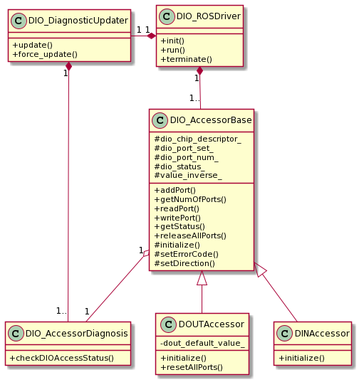

# Class diagram
The following diagram shows the class structure of `dio_ros_driver`. 

`dio_ros_driver` is constructed of main 6 types of class.

## Classes
### `DIO_ROSDriver` class
* **Responsibility**  
  * To integrates all function; interface between DIO module and Autoware (ROS nodes).

* **Function**
  * To initialize all objects including accessor and diagnostic function to realize `dio_ros_driver`
  * To execute all function with accessors and diagnostic function
  * To terminate the process with the predefined sequence

### `DIO_AccessorBase` class
* **Responsibility**  
  * Base class to provide basic function to read/write raw value from/to port provided DIO module

* **Function**  
  * To initialize DIO module and get permission of ports access
  * To provide basic function to access DI and DO ports
    * To read value from port function
    * To deliver accessor's scope

### `DINAccessor` class
* **Responsibility**  
  * To read value from DI ports and return it
  
* **Function**  
  * To manage DI ports to be selected
  * To read value from DI ports
  * To warn if write access is invoked to DI ports

### `DOUTAccessor` class
* **Responsibility**  
  * To write value to DO ports and return it
  
* **Function**  
  * To manage DO ports to be selected
  * To write value to DO ports

### `DIO_DiagnosticUpdater` class
* **Responsibility**  
  * Wrapper class of `diagnostic_updater`
  
* **Function**  
  * To update `/diagnostic` topic to notify warning or error, and status
  * To call callback function using a method from `DIO_AccessorDiagnosis` 

### `DIO_AccessorDiagnostis` class
* **Responsibility**  
  * To aggregate status from a corresponding accessor embodied from `DIO_AccessorBase`, and format status to send `/diagnostic`
  
* **Function**  
  * To update status with aggregating status data from a corresponding accessor whose pointer `DIO_accessorDiagnostic` has.
  * To format diagnostic information to send `/diagnostic`

