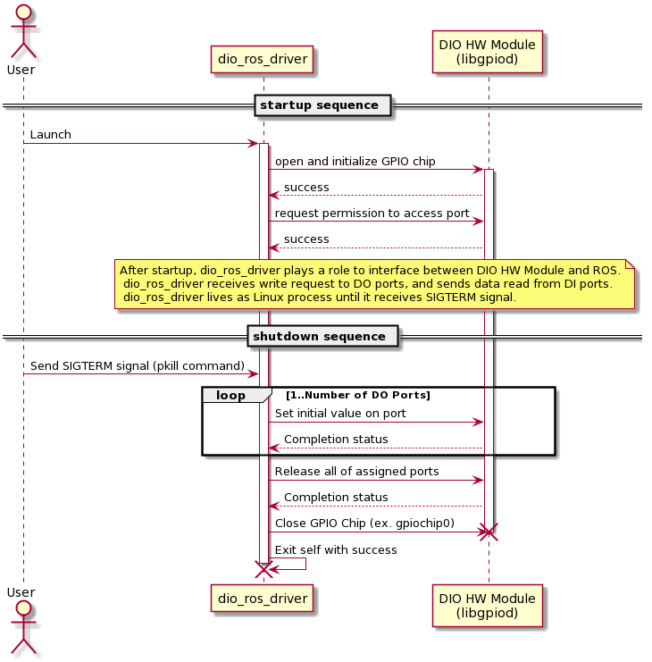
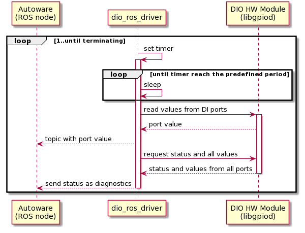
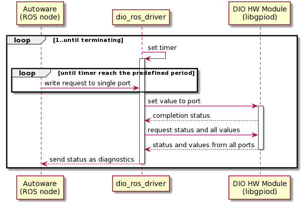

# Sequence Diagram

## Lifecycle

The following diagram shows sequence from startup to shutdown of `dio_ros_driver`.
User can startup `dio_ros_driver` with `roslaunch` command, and `dio_ros_driver` is terminated with `SIGTERM` signal.  

`dio_ros_driver` is activated by user's launch request.
During startup, `dio_ros_driver` initializes DIO chip, though it is GPIO chip,and lines to access.  

`dio_ros_driver` will shutdown the process after receiving `SIGTERM` signal. `dio_ros_driver` resets all DO ports with initial value. `dio_ros_driver` releases all ports from accessing resource, and close DIO chip. Finally, `dio_ros_driver` exits its' own process.

It means that `dio_ros_driver` has mainly 3 states: `initting` state, `running` state, and `terminating` state. `dio_ros_driver` class has methods which runs on each state.

## DI ports Access
`dio_ros_driver` reads values from selected ports periodically. The reading period is defined by `access_frequency`.  
The sequence of DI port read is very simple. The main sequence is invoked by timer. When timer reaches predefined time, `dio_ros_driver` reads values from DI ports, and returns this value to Autoware (ROS node) by publishing topic.  
`dio_ros_driver` checks status of ports and send the result to Autoware as `/diagnostic`

## DO ports Access
`dio_ros_driver` receives DO access request from Autoware (ROS node). `dio_ros_driver` sets value to a selected port according to the request. As well as sequence for DI access, `dio_ros_driver` sets value periodically while it can receives the request always.  
`dio_ros_driver` checks status of ports and send the result to Autoware as `/diagnostic`

